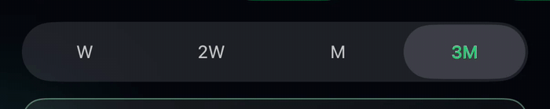

# LensTintSegmentedControl

Apple Health's picker does something `UISegmentedControl` can't: as you drag
its Liquid Glass thumb, the glyphs underneath tint **where the glass covers
them** — one letter half accent, half resting, split exactly at the lens rim.
The stock control only colours titles by selected state, whole-label at a
time.

This package grafts that lens-positional tint onto a real
`UISegmentedControl` — system glass thumb and all — plus two more behaviours
Health's picker has and the stock control doesn't: the bar swells and
densifies while the thumb is held, and relaxes on release.



## Usage

SwiftUI:

```swift
import LensTintSegmentedControl

enum Range: Hashable { case week, month, quarter }

@State private var range = Range.month

LensTintSegmentedPicker(
    selection: $range,
    segments: [
        .init(value: .week,    label: "W",  accessibilityLabel: "Last 7 days"),
        .init(value: .month,   label: "M",  accessibilityLabel: "Last 30 days"),
        .init(value: .quarter, label: "3M", accessibilityLabel: "Last 90 days"),
    ],
    accent: .green
)
.frame(height: 44)
```

UIKit: wrap your own `UISegmentedControl` in `LensTintSegmentedControlView`
(set `selectedSegmentTintColor = nil` and pin both title states to your
resting colour — any non-nil segment tint replaces the glass thumb with a
flat fill).

### Knobs

| Parameter | Default | What it does |
|---|---|---|
| `accent` | — | The lens-positional tint colour |
| `restingTitleColor` | `.secondaryLabel` | Title colour outside the lens |
| `restingFillAlpha` | `0.5` | Ceiling on the settled thumb's milky platter fill (1 = stock). Lower keeps it closer to clear glass — the stock platter reads opaque over dark backgrounds |
| `railGrowth` | `0.10` | How much the whole bar grows while held (Health uses ~0.2) |
| `railDensify` | `0.25` | Peak alpha of a black wash densifying the held bar |
| `softness` | `10` | Feather width of the tint's edge at the lens rim, in points |

### Behaviour contract

- **One commit per gesture.** The binding is written on release, not per
  segment crossing. A cancelled gesture (incoming call, system sheet) rolls
  back instead of committing.
- **External writes never fight the finger.** Binding changes arriving
  mid-drag are deferred until the gesture resolves.
- **VoiceOver** speaks the per-segment `accessibilityLabel`s.
- **Reduce Motion** disables the added bar growth (the system's own thumb
  animation remains the system's).
- The per-frame tracking loop pauses ~1.5s after everything settles and
  wakes on touch, so an idle picker costs nothing.

## How it works

On current iOS the segmented control's thumb is a private
`_UILiquidLensView`: its shape is a signed-distance field, and while you hold
it the system *erases* the real label row under the glass (a
destination-out compositing pass that tracks the thumb) and re-renders it
through a portal, magnified and refracted. The label row itself is drawn
once, state-coloured — which is why no public API produces a mid-glyph tint
split: title attributes are keyed on `UIControl.State`, whole-label.

The graft:

1. Pins both title states to the resting colour, so no colour comes from
   selection.
2. Builds an accent-coloured copy of the label row, double-masked — by the
   glyphs' own alpha, and by a feathered capsule tracking the lens's live
   presentation frame every screen refresh.
3. **Injects that copy into the control's own segment container** — the row
   the portal samples. That placement is the whole trick: the system then
   erases, re-renders, magnifies and chromatically fringes the accent copy in
   lockstep with the labels it shadows. (An overlay *above* the control
   doesn't work — the magnified portal image draws over it.)

The bar growth is driven by touch presence via a zero-delay long-press
recognizer, not by lens geometry — the liquid lens bobs its height while
travelling, and `UISegmentedControl`'s thumb drag bypasses UIControl tracking
entirely (`isTracking` stays false; `.touchDown` never fires), so touch
observation is the only reliable signal. Easing is exponential in real
display-link time, so the feel is identical at 30, 60 and 120Hz.

## The caveat

This walks a **private view hierarchy**: subviews are matched by class-name
substring, frames are read, and one subview is added. No private selectors
are messaged and no private symbols are linked — every call is public
`UIView`/`UILabel`/`CALayer` API — but the hierarchy's *shape* is an
implementation detail Apple can change in any release.

The component assumes it will: if its lookups fail for one second it removes
the graft, restores a state-keyed accent `.selected` title, and logs. The
worst case is a plain, fully-native segmented control with an accent-coloured
selected label.

## Requirements

- iOS 26+ (the Liquid Glass thumb)
- Swift 6

## Installation

Swift Package Manager:

```swift
.package(url: "https://github.com/smabe/LensTintSegmentedControl.git", from: "0.1.0")
```

## License

MIT
